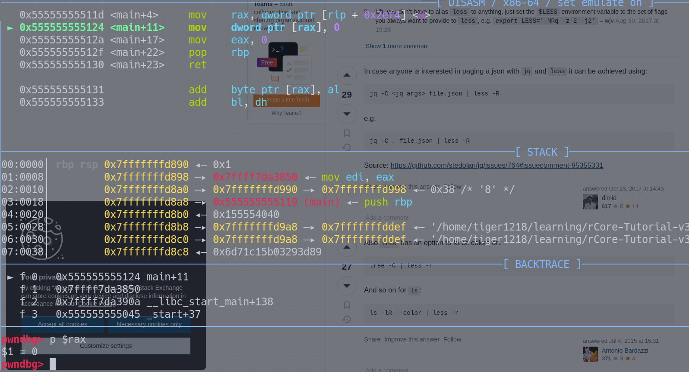

## 在你日常使用的操作系统环境中安装并配置好实验环境。简要说明你碰到的问题/困难和解决方法。

日常使用系统：`ArchLinux`。

问题：`make run`的时候报错无`rust-objcopy` , 解决方案是将`Rust Bin Path` 设置到 `PATH` 中。

## 在Linux环境下编写一个会产生异常的应用程序，并简要解释操作系统的处理结果。

```c
#include <stdio.h>
int * a;
int main(){
    *a = 0;
    return 0;
}
```



执行到该条指令，CPU发出信号`SEGSEGV`。随后终止程序。

## Linux环境下编写一个可以睡眠5秒后打印出一个字符串，并把字符串内容存入一个文件中的应用程序A。(基于C或Rust语言)

